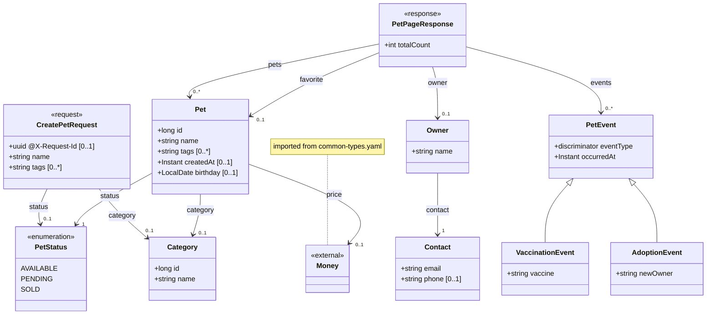
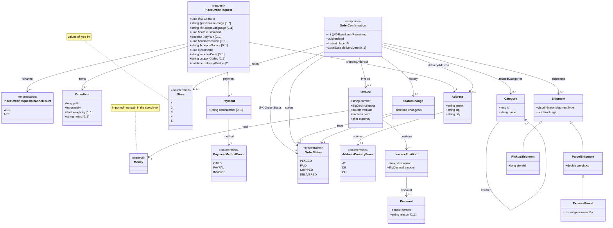
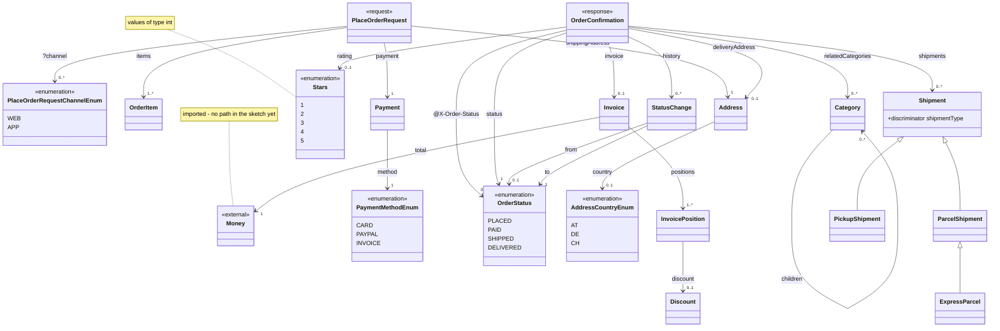

# OpenAPI → Jakarta EE 10 DTO Demo

Maven multi-module demo showing how to generate REST-API **DTO classes** from an OpenAPI spec
via `org.openapitools:openapi-generator-maven-plugin`, targeting **JAX-RS 3.1 / Jakarta EE 10**
(`jakarta.*` namespace instead of `javax.*`) — with two ways of authoring the spec:

| Module | Spec authored as | Toolchain |
|---|---|---|
| [`yaml-first/`](yaml-first/) | hand-written OpenAPI YAML (`src/main/openapi/petstore.yaml`) | JDK + Maven only |
| [`typespec-first/`](typespec-first/) | [TypeSpec](https://typespec.io) (`src/main/typespec/main.tsp`), compiled to OpenAPI YAML during the build | additionally Node.js + pnpm |
| [`sketch-first/`](sketch-first/) | custom **SpecSketch** DSL (`src/main/sketch/petstore.sketch`), translated to OpenAPI YAML by a single-file Java generator | JDK + Maven only |
| [`code-first/`](code-first/) | **hand-written Java**: a JAX-RS resource plus its model, read by reflection and emitted as SpecSketch + OpenAPI YAML | JDK + Maven only |

`yaml-first` and `typespec-first` describe the **same API** and end up with functionally
identical generated DTOs (`Pet`, `NewPet`, `Category`, `PetStatus`, `ApiError`).
`sketch-first` demonstrates a response-only API defined in a minimal custom format.
`code-first` runs the other direction: the Java code is the source of truth and the spec is
derived from it. A sketch also has readers besides the OpenAPI translation: it is
[drawn as a class diagram](#the-same-sketch-as-a-diagram-mermaid-and-plantuml), in Mermaid or in
PlantUML.

## Requirements

- JDK 17+ (built and tested with JDK 25; code targets `--release 17`, the Jakarta EE 10 baseline)
- Maven 3.9+
- For `typespec-first` only: Node.js + pnpm on the `PATH`
  (the module installs the TypeSpec compiler itself via `pnpm install --ignore-scripts`)

## Build

```bash
mvn clean verify            # both modules
mvn clean verify -pl yaml-first   # only the Node-free module
```

Generated DTOs land in `<module>/target/generated-sources/openapi/src/gen/java/org/os890/sketch/petstore/dto/`
and are registered as a compile source root automatically — generated code never lives in `src/`.

## How it works

### Shared setup (parent `pom.xml`)

The `openapi-generator-maven-plugin` configuration lives in the parent's `<pluginManagement>`;
each module only contributes its `<inputSpec>`. The key generator settings:

| Setting | Value | Effect |
|---|---|---|
| `generatorName` | `jaxrs-spec` | Plain JAX-RS target (server-framework agnostic) |
| `useJakartaEe` | `true` | **The Jakarta EE 10 switch** — emits `jakarta.validation` / `jakarta.ws.rs` imports instead of `javax.*` |
| `generateApis` | `false` | DTOs (models) only, no API interfaces |
| `useSwaggerAnnotations` | `false` | Keeps DTOs dependency-light (no swagger-annotations needed) |
| `dateLibrary` | `java8` | `OffsetDateTime` for `format: date-time` |

### `yaml-first`

Classic spec-first: the OpenAPI YAML is the source of truth, the plugin generates the DTOs
in the `generate-sources` phase. No extra tooling.

### `typespec-first`

The spec is written in TypeSpec — a concise, type-checked DSL that compiles to OpenAPI.
Compare `typespec-first/src/main/typespec/main.tsp` (~70 lines incl. operations) with the
equivalent `yaml-first/src/main/openapi/petstore.yaml`: no indentation pitfalls, real reuse
(`NewPet` is derived from `Pet` via `OmitProperties` instead of copy/paste).

The Maven build chains three steps in the `generate-sources` phase (declaration order matters):

1. `exec-maven-plugin` → `pnpm install --ignore-scripts` (fetches the TypeSpec compiler, pinned via `pnpm-lock.yaml`)
2. `exec-maven-plugin` → `pnpm exec tsp compile src/main/typespec/main.tsp`
   → emits `target/generated-openapi/petstore.yaml` (configured in `tspconfig.yaml`)
3. `openapi-generator-maven-plugin` → generates the DTOs from that emitted YAML

So the TypeSpec file is the single source of truth; both the OpenAPI document and the Java DTOs
are build artifacts.

### `sketch-first`

The spec is written in **SpecSketch**, a deliberately minimal line-based format, and translated
to OpenAPI YAML by [`src/main/tools/SpecSketchGenerator.java`](sketch-first/src/main/tools/SpecSketchGenerator.java) —
a single, dependency-free Java file executed via the JDK's source-code launcher
(`java SpecSketchGenerator.java …`, no compilation step). It generates one operation:
a mandatory top-level `response` defines the response payload, an optional top-level
`request` defines the request payload — with a request the operation becomes a **POST
with a request body**, without one a **GET with an empty request**.

One definition per line:

```
<name> (<occurrence>) : <type>
```

```
request (1) : CreatePetRequest
    name (1) : string
    status (0 - 1) : enum [AVAILABLE, PENDING, SOLD]
    category (0 - 1) : Category

response (1) : PetPageResponse
    pets (0 - *) : Pet
        id (1) : long
        name (1) : string
        category (0 - 1) : Category
            id (1) : long
            name (1) : string
    totalCount (1) : int
    favorite (0 - 1) : Pet
```

Rules:

- **Occurrence:** a number (`1`, `3`) or a range (`0 - 1`, `1 - *`, `2 - 5`).
  `min >= 1` makes the property `required`; `max > 1` or `*` makes it an array
  (with `minItems`/`maxItems` derived from the range).
- **Nesting:** 4 spaces or 1 tab per level, unlimited depth. A line with fewer spaces
  implicitly ends all deeper structures and lands on the level matching its indentation
  (see `totalCount` above, which returns from `Category`-depth back to the response level).
- **Types:** a type with indented properties becomes an object schema — but its details may
  only be defined at its **first occurrence**; every further usage references it by name,
  and the output contains a single schema plus `$ref`s (recursive types work too). A type
  without properties is either a built-in or a reference to a type defined elsewhere in the
  file (see `favorite`, which reuses `Pet` — the request above references the `Category`
  defined later in the response part). Property names must be unique within a type, and every
  type definition needs at least one property: a property-less object schema means "any object"
  in OpenAPI, so DTO generators drop the model and references to it degrade to `Object`.
- **Built-in types** (case-insensitive — `string`, `String` and `STRING` are the same; custom
  type names on the other hand must differ by more than case *and* underscores, since OpenAPI
  tooling camelizes schema names — `my_type` and `MyType` would collapse into one generated
  class, so they are rejected as an error): OpenAPI-style `string`, `number`, `integer`,
  `boolean`, `date`, `datetime`, `uuid`; Java primitives and wrappers `int`, `long`, `short`,
  `byte`, `char`, `float`, `double`, `boolean`, `String`, `BigDecimal`, `BigInteger`; and the
  java.time classes `LocalDate`, `LocalDateTime`, `OffsetDateTime`, `ZonedDateTime`,
  `Instant`, `LocalTime`, `OffsetTime`. With `dateLibrary=java8`, `date`/`LocalDate` become
  `LocalDate` fields and all date-time variants become `OffsetDateTime` fields in the
  generated DTOs; `char` maps to a string with `minLength`/`maxLength` 1.
- **Enums:** shorthand via the keyword `enum` followed by the values in brackets, e.g.
  `gender (1) : enum [M, F]` — emitted as an inline string enum, which the DTO generator
  turns into an inner Java enum of the surrounding class (e.g. `Pet.StatusEnum`). Works in
  arrays too (`workingDays (1 - 7) : enum [MON, …]`). The value type defaults to string and
  can be set explicitly to any string or numeric built-in via `enum:<type>`:
  `gender (1) : enum:String [M, F]` is identical to the default, while
  `stars (1) : enum:int [1, 2, 3, 4, 5]` produces a numeric enum.
- **Inheritance:** inside a type definition, `extended by <SubType>` starts a subtype block
  whose nested lines are the *additional* properties (the wording follows the reading
  direction: the base is extended by its subtypes). Re-declaring a property of the base chain
  is an error — the block only adds. Subtypes become `allOf` compositions, join the type
  registry (referable, define-once, name rules) and may be nested for deeper hierarchies.
  Marking one base property with the reserved type `discriminator` makes the hierarchy
  polymorphic: the property becomes a required string, the schema gets `discriminator` + a
  mapping of all transitive subtypes, and the generated Java carries
  `@JsonTypeInfo`/`@JsonSubTypes` — so JSON deserializes into the concrete subtype.

  One subtlety on the **producing** side, handled by the shared generator config: the discriminator
  is a declared, required property (that is what `discriminator.propertyName` expects) *and*
  openapi-generator emits `@JsonTypeInfo(…, visible = true)` for it, so Jackson would write it
  twice — once as the type id, once as the bean member, which is `null` unless the application
  assigns it. A consumer keeping the last occurrence of the duplicate key would then read `null`
  and fail to resolve the subtype. The DTOs are therefore generated with `@JsonInclude(NON_NULL)`
  at class level (`additionalModelTypeAnnotations` in the parent pom), which drops the empty one:

  ```
  before:  {"eventType":"VaccinationEvent","vaccine":"rabies","eventType":null,"occurredAt":"…"}
  now:     {"eventType":"VaccinationEvent","vaccine":"rabies","occurredAt":"…"}
  ```

  A plain `ObjectMapper` is enough, with nothing to configure at the call site;
  `GeneratedDtoTest.aSubtypeMustNotSerializeTheDiscriminatorTwice` pins it down.

  **The discriminator is also what produces real Java inheritance** (`class Car extends Vehicle`):
  without it the `allOf` composition is still valid OpenAPI, but openapi-generator flattens it
  into a standalone class that repeats the base properties instead of extending the base class.
  ```
  vehicles (0 - *) : Vehicle
      vehicleType (1) : discriminator
      maxSpeed (1) : int
      extended by Car
          doors (1) : int
      extended by Bike
          electric (1) : boolean
  ```
- **Named enums:** a name between keyword and values makes the enum reusable —
  `status (1) : enum PetStatus [AVAILABLE, PENDING, SOLD]` defines it at its first
  occurrence (like object types); every other usage references it plainly by name
  (`status (1) : PetStatus`, forward references included). Composes with the value type
  (`stars (1) : enum:int Rating [1, 2, 3]`). Named enums become a single named schema,
  which the DTO generator turns into one shared top-level Java enum (`PetStatus.java`)
  instead of an inner enum per DTO; the define-once and case-collision rules apply to
  them like to any other named type.
- **Parts:** top-level `response` is mandatory; top-level `request` is optional and makes the
  operation a POST whose request body is required if the request occurrence minimum is >= 1
  (`request (0 - 1) : …` → optional body). Further top-level lines define reusable types.
- **Headers:** direct children of `request`/`response` whose name starts with `@` are HTTP
  headers instead of body properties, e.g. `@X-Client-Id (1) : uuid`. Occurrence works as
  usual (`(1)` → `required: true`, `(0 - 1)` → optional, `(0 - *)` → repeatable/array), and
  any type works — built-ins, inline or named enums. Request headers become `in: header`
  parameters, response headers land in the response's `headers` section. A request that
  contains only headers has no body and stays a GET, so header definitions work without
  forcing a POST. Header names must be unique per part — HTTP header names are
  case-insensitive, so `@X-Id` and `@x-id` count as the same header.
- **Parameters:** direct children of `request` may carry the other parameter sigils, and **saying
  where a parameter comes from is optional** — a first sketch can state that an operation takes a
  `petId` before the URL shape is settled:
  ```
  request (1) : GetPetParams
      $petId (1) : long                 // a parameter — the location is not decided yet
      $path:petId (1) : long            // decided later: a path parameter
      $query:status (0 - 1) : PetStatus
      $cookie:session (0 - 1) : uuid
      $header:X-Client-Id (1) : uuid    // the long form of '@X-Client-Id'
  ```
  `?name` is shorthand for `$query:name` and `{name}` for `$path:name`, so the two common cases
  read like the URL they end up in (`?status (0 - 1) : PetStatus`, `{petId} (1) : long`).
  Refining a draft is a pure prefix edit — `$petId` → `{petId}` — nothing else on the line moves.
  OpenAPI has no `in` value for "not decided", so an undecided `$name` is emitted as a query
  parameter **and reported**: the document stays usable, the guess never stays silent. Occurrence,
  types and attributes work exactly as on headers, and parameters are never body properties, so a
  request of parameters alone has no body and stays a GET. Names must be unique per location
  (`{id}` and `?id` are two distinct parameters). `in: path` is the one location OpenAPI
  constrains: it must be required (`(1)`), cannot repeat, cannot carry an object type, and its
  name has to appear in the path template — which is derived from the file name, so path
  parameters are appended to it in declaration order (`getPet` + `{petId}` → `/getPet/{petId}`).
  Where those segments really sit in the URL is not expressible yet, so the derived path is
  reported as the guess it is.
- **Imports:** a top-level `import <TypeName>` declares a type whose details already live in a
  shared/common yaml file — no local schema is generated; every usage becomes an external
  `$ref` with a type-specific placeholder to be filled in:
  `$ref: 'TODO-IMPORT/Address.yaml#/components/schemas/Address'`. A pathless import is
  reported with its sketch line, since no OpenAPI tool can resolve that placeholder. You can
  fill the path into the **result file** instead — the next run adopts it back into the
  sketch's `import` line (reporting the change), so the sketch stays the single source of
  truth and a fresh clone regenerates the same document. If the file is already known,
  `import Money from "common-types.yaml"` emits the real ref right away — the petstore sketch
  does exactly that with [`common-types.yaml`](sketch-first/src/main/sketch/common-types.yaml),
  and the DTO generator resolves the external file and generates `Money.java` from it.
  **Paths are relative to the sketch**, not to the result file: when the yaml is written to a
  different directory (as the Maven build does, into `target/`) the generator rebases them, so
  a sketch never has to know where its yaml lands. Defining properties for an imported type is
  an error; imports join the type registry (define-once, name rules).
- **Attributes:** a property line may end with an optional `{key: value, …}` validation block,
  checked against the property's type: `minLength`, `maxLength` and `pattern` for the plain
  `string` type, `min`/`max` (aliases `minimum`/`maximum`) for numeric types. The string
  attributes are deliberately *not* allowed on `date`, `datetime`, `uuid` or the java.time
  built-ins: those become `LocalDate`/`OffsetDateTime`/`UUID` fields, where the generated
  `@Size`/`@Pattern` would throw `UnexpectedTypeException` the first time the DTO is validated.
  Values may be double-quoted — required when they contain commas or braces
  (`{pattern: "^[a-z]{2,3}$"}`). On arrays the attributes apply to the *items* (the array
  bounds already come from the occurrence). The DTO generator turns them into Bean Validation
  annotations: `name (1) : string {minLength: 1, maxLength: 100}` → `@Size(min = 1, max = 100)`.
- **Comments:** every line may end with a comment via `//`, `#` or `/* … */` (the block form
  may also sit mid-line, closed on the same line). Comment markers inside a double-quoted
  value belong to the value, so patterns and import paths may contain `#`, `//` and `/*`
  (`{pattern: "^#[0-9a-f]{6}$"}`, `import Money from "https://…/common.yaml"`). Comment-only
  lines are ignored at *any* indentation, so they never affect the nesting. Blank lines are
  ignored as well.
- Errors (broken indentation, undefined types, conflicting redefinitions, duplicate property,
  header or parameter names, attributes on a type that cannot carry them) are reported with line
  numbers and fail the build — the guiding rule is that a sketch either fails with a line number or yields
  an OpenAPI document the toolchain accepts, never a silently wrong one.

The translation itself is covered by
[`SpecSketchGeneratorTest`](sketch-first/src/test/java/SpecSketchGeneratorTest.java)
(request/response variants, every occurrence form, Java primitive/wrapper and java.time
type mapping, deep nesting, multi-level implicit dedents, tab indentation, type reuse
including recursive types, and the error cases). Every document a test generates is
additionally run through **swagger-parser** — the same parser `openapi-generator` uses, which
must accept it without a single message — and through **SnakeYAML** as a strict YAML 1.1
reader, which must see string keys only (unquoted `on`, `yes` or `null` would otherwise turn
a property name into a boolean or null). Both are test-scoped: the generator itself stays
dependency-free. External `$ref`s are not resolved, because an `import` without a known path
deliberately emits a `TODO-IMPORT` placeholder pointing at a file that does not exist yet.
`src/main/tools` is added as a source root via the `build-helper-maven-plugin`, so the tests can
call the generator and it ships in the module jar, whose `Main-Class` makes that jar runnable.

The Maven build chains two steps in the `generate-sources` phase:

1. `exec-maven-plugin` → `java src/main/tools/SpecSketchGenerator.java src/main/sketch/petstore.sketch target/generated-openapi/petstore.yaml`
2. `openapi-generator-maven-plugin` → generates the DTOs from that emitted YAML

Try it standalone — with only the input path the YAML is saved next to the input file
(`petstore.sketch` → `petstore.yaml`); a second argument sets an explicit output path,
`-` prints to stdout:

```bash
java sketch-first/src/main/tools/SpecSketchGenerator.java sketch-first/src/main/sketch/petstore.sketch
java sketch-first/src/main/tools/SpecSketchGenerator.java sketch-first/src/main/sketch/petstore.sketch -
```

No build step is needed (JDK source launcher), but since the generator has no dependencies
outside the JDK it can also be compiled classically: `javac SpecSketchGenerator.java`.

The jar built by Maven is runnable — the generator is compiled into the module and the
`Main-Class` manifest entry points at it, so after `mvn package` (or `verify`):

```bash
java -jar sketch-first/target/sketch-first-1.0.0-SNAPSHOT.jar my-api.sketch              # saves my-api.yaml next to the input
java -jar sketch-first/target/sketch-first-1.0.0-SNAPSHOT.jar my-api.sketch out/api.yaml # explicit output path
java -jar sketch-first/target/sketch-first-1.0.0-SNAPSHOT.jar my-api.sketch -            # print to stdout
```

The first form is the normal layout: sketch and result yaml side by side, both under version
control, neither in a build output folder — the yaml is the file you hand to the openapi plugin
(or to any consumer), so it has to be durable. Because of that the generator reconciles with an
existing result file instead of truncating it blindly:

```bash
$ java -jar …jar petstore.sketch            # first run, path not filled in yet
SpecSketchGenerator: warning: line 1: import 'Money' has no path yet - the result file gets a
  TODO-IMPORT placeholder that OpenAPI tooling cannot resolve; add: import Money from "<file>"
SpecSketchGenerator: petstore.sketch -> petstore.yaml

# replace TODO-IMPORT/Money.yaml with common-types.yaml in petstore.yaml, then:
$ java -jar …jar petstore.sketch
SpecSketchGenerator: line 1: adopted the path filled in for 'import Money' into the sketch:
  from "common-types.yaml"                  # the sketch now carries it permanently

$ java -jar …jar petstore.sketch            # nothing changed -> the file is left alone
SpecSketchGenerator: petstore.yaml is already up to date

$ java -jar …jar petstore.sketch            # after a hand edit the sketch cannot express
SpecSketchGenerator: warning: petstore.yaml differed from the sketch and was overwritten -
  review the change before committing it
```

Overwriting is the default — in a repository it simply becomes a change to review and commit —
but it is reported, where previously any manual edit vanished without a trace.

The jar is fully self-contained (the generator has no dependencies outside the JDK), so it
can be copied anywhere and run with any JDK 17+. Note it also contains the module's
generated DTO classes; that doesn't affect running the generator.

A tour of **every** DSL feature in one definition lives in
[`showcase.sketch`](sketch-first/src/main/sketch/showcase.sketch) (not wired into the
build — run it through the generator as above to see the resulting OpenAPI document).

#### The same sketch as a diagram: Mermaid and PlantUML

A sketch describes a model, and a model reads better as a picture than as either of its text forms.
Two generators draw it — [`SketchMermaidGenerator`](sketch-first/src/main/tools/SketchMermaidGenerator.java)
as a [Mermaid](https://mermaid.js.org/) class diagram, and
[`SketchPlantUmlGenerator`](sketch-first/src/main/tools/SketchPlantUmlGenerator.java) as a
[PlantUML](https://plantuml.com/class-diagram) one — and neither of them reads the DSL a second time:
both call `SpecSketchGenerator`, translate the sketch to YAML, throw that result away and draw the
very node tree the translation walks. So the picture can never disagree with the document, and a
sketch that would not produce a valid OpenAPI document produces no diagram either — it fails with the
same message and the same line number.

What a diagram contains is decided **once**, in
[`SketchDiagram`](sketch-first/src/main/tools/SketchDiagram.java): boxes with members, inheritance
arrows and labelled associations, in a form no diagram language has yet. That is where all the
thinking sits; spelling it out in mermaid or in PlantUML is a formatting question, and one nobody
should have to answer twice. A rule added there reaches both languages, and neither can drift away
from the other.

| in the sketch | in the diagram |
| --- | --- |
| a type with properties | a box, in declaration order |
| the `request` / `response` part | that box, marked `<<request>>` / `<<response>>` |
| a property of a built-in type | a member, spelled as the sketch spells it: `+long id`, `+Instant createdAt` |
| an occurrence other than `(1)` | a UML multiplicity: `+string tags [0..*]`, `[0..1]`, `[1..*]`, `[2]`, `[0..3]` |
| a property of a named type | an association carrying that multiplicity: `PetPageResponse --> "0..*" Pet : pets` |
| a self-reference | the association it is: `Category --> "0..*" Category : children` |
| a parameter or header | a member keeping its sigil: `@X-Request-Id`, `?status`, `$cookie:session`, `$petId` when the location is still undecided — and `$path:petId` for `{petId}`, since braces would end the class body both languages write in braces |
| `extended by <SubType>` | `Base <\|-- Sub`, the subtype box holding only the properties it adds (the `allOf` composition) |
| a `discriminator` property | a member that keeps the reserved type as its type: `+discriminator eventType` |
| a named enum | one enum box every usage links to (`<<enumeration>>` in mermaid, which has no enum form of its own; `enum` in PlantUML) |
| an inline enum | an enum box named `<OwnerType><Property>Enum` — the inner enum openapi-generator derives from it |
| `enum:int`, `enum:long`, … | a note on that box (`values of type int`): `enum [1, 2]` and `enum:int [1, 2]` list the same values but are different enums |
| `import <Type>` | an `<<external>>` box with a note naming the file its details live in |

Left out on purpose is everything that describes the wire format rather than the model: validation
attributes (`{minLength: 1}`), the OpenAPI type and format behind each built-in, the HTTP method,
the derived path template and the content type. Those live in the generated YAML; a class diagram
repeating them would be unreadable without being any more complete. Two corner cases have their own
answer: a part that declares its payload instead of naming a type gets a box named after the part
(`response (1) : string` draws a `<<response>>` box `response` holding `+string body`), and a request
of parameters alone draws just those — it has no body in the YAML either.

Usage mirrors `SpecSketchGenerator`, with `.mmd` / `.puml` instead of `.yaml` — the suffixes the two
toolchains read — and with the same reconciliation: an existing diagram that differs is overwritten,
but the overwrite is reported instead of silently discarding a hand edit. A jar has one `Main-Class`,
so each generator gets its own classified artifact; all three jars contain all three generators, only
the manifest differs.

```bash
java -jar sketch-first/target/sketch-first-1.0.0-SNAPSHOT-mermaid.jar  my-api.sketch  # -> my-api.mmd next to it
java -jar sketch-first/target/sketch-first-1.0.0-SNAPSHOT-plantuml.jar my-api.sketch  # -> my-api.puml next to it
java -jar …-mermaid.jar my-api.sketch docs/api.mmd    # explicit output path
java -jar …-mermaid.jar my-api.sketch -               # print to stdout
java -jar …-mermaid.jar my-api.sketch --structure     # -> my-api-structure.mmd (see below)

# without the jar: a diagram generator needs SpecSketchGenerator and SketchDiagram, so the
# single-file source launcher only works on JDK 22+, which compiles the siblings from the same folder
java sketch-first/src/main/tools/SketchPlantUmlGenerator.java sketch-first/src/main/sketch/petstore.sketch -

# on JDK 17-21 compile the tools once
javac -d out sketch-first/src/main/tools/*.java && java -cp out SketchPlantUmlGenerator my-api.sketch
```

Both suffixes belong next to the sketch and its yaml, like any other result — the license check skips
them, since a generated diagram carries no header. Rendering is up to the consumer: GitHub, GitLab,
the IDE plugins and the two command-line tools all read the files as they are written. To get images
without installing anything, the official containers render into an unversioned folder:

```bash
mkdir -p sketch-first/target/diagrams
java -jar sketch-first/target/sketch-first-1.0.0-SNAPSHOT-mermaid.jar \
    sketch-first/src/main/sketch/showcase.sketch sketch-first/target/diagrams/showcase.mmd
java -jar sketch-first/target/sketch-first-1.0.0-SNAPSHOT-plantuml.jar \
    sketch-first/src/main/sketch/showcase.sketch sketch-first/target/diagrams/showcase.puml

podman run --rm -v "$PWD":/data ghcr.io/mermaid-js/mermaid-cli/mermaid-cli:latest \
    -i sketch-first/target/diagrams/showcase.mmd -o sketch-first/target/diagrams/showcase.png -s 2
podman run --rm -v "$PWD":/data docker.io/plantuml/plantuml:latest \
    -tpng "/data/sketch-first/target/diagrams/showcase.puml"
```

The diagrams below are the mermaid output, because GitHub renders it in place; the PlantUML files
state the same boxes and arrows, with the stereotype on the declaration
(`class Pet <<response>>`), PlantUML's own `enum` form, and each note attached below its box.

This is [`petstore.sketch`](sketch-first/src/main/sketch/petstore.sketch), rendered by GitHub from
the generator's own output:



And this is [`showcase.sketch`](sketch-first/src/main/sketch/showcase.sketch), the tour of **every**
DSL feature: 20 classes with every field they carry, the nested polymorphic `Shipment` hierarchy,
both kinds of enum, an `import` whose path is not filled in yet, and each parameter sigil. It is also
the honest argument for the option below — at this size the fields take most of the space:



##### `--structure`: the type graph without the detail

The full view answers *what does this payload look like*. On a model of any size the more common
question is *which types are there and how do they relate*, and the answer is in the boxes and
arrows alone — the strings and numbers only make it harder to see. `--structure` drops every
attribute of a built-in type (parameters and headers included) and keeps the rest: classes, enums,
imports, associations with their multiplicities, and inheritance. Two things stay although they are
not classes, because they say what a type **is** rather than what it holds — the values of an enum,
and the `discriminator`, which is what makes the hierarchy below it polymorphic.

Both generators take the option, and in both the two views get two default file names
(`my-api.mmd` / `my-api-structure.mmd`, `my-api.puml` / `my-api-structure.puml`), so asking for one
never overwrites the other; the structure view carries a second header comment stating that fields
are missing on purpose. This is the showcase above once more, as its type graph alone — same 20
classes, same arrows, 106 lines instead of 155:



Both renderings are covered by
[`SketchMermaidGeneratorTest`](sketch-first/src/test/java/SketchMermaidGeneratorTest.java) and
[`SketchPlantUmlGeneratorTest`](sketch-first/src/test/java/SketchPlantUmlGeneratorTest.java). Neither
a mermaid nor a PlantUML parser is on the classpath — the generators stay dependency-free, and a
headless browser is not a test dependency — so every diagram a test produces is read back with the
grammar its generator is allowed to emit (box declarations, stereotypes, members, `<|--`, `-->`,
notes) and nothing else. That is what pins down the escaping rules: no member text may contain a brace
(it would end the class body) or a parenthesis (both languages would read the line as a method), and
every box a diagram links has to be declared in it. One test closes the loop on the shared model from
the other side — for one sketch, the two languages must state the same boxes and the same arrows, in
both views.

### `code-first`

The mirror image of `sketch-first`: instead of turning a sketch into a spec, `JavaSketchGenerator`
turns compiled Java into the sketch and then hands it to `SpecSketchGenerator`, so both artifacts
can never disagree and the yaml inherits every validation rule that lives there.

```
PetResource.java + model/*.java  --(reflection)-->  <endpoint>.sketch  --(SpecSketchGenerator)-->  <endpoint>.yaml
```

The entry point is a **JAX-RS resource class** — its endpoints already state which types go in and
out. One `.sketch` + `.yaml` pair is written per endpoint method (the DSL describes one operation
per file), side by side under `src/main/sketch/`, both under version control.

- **Endpoints** — HTTP method from `@GET`/`@POST`/…, request body from the parameter that carries
  no JAX-RS parameter annotation, response from the return type with `List`/`Set`/array unwrapped
  into an array occurrence.
- **A method returning `jakarta.ws.rs.core.Response`** hides its payload. The type is taken from
  `@APIResponse(content = @Content(schema = @Schema(implementation = Pet.class)))`, and failing
  that from an explicit mapping (`--response createPet=…`, or a properties file via
  `--responses`). If neither resolves it, the endpoint is an **error** rather than a silently
  empty response. All three routes are live in `PetResource`: `listPets` declares it in the
  signature, `getPet` via `@APIResponse`, `createPet` via the pom's `--response` argument.

  The annotations read here are the **standardized** ones —
  [MicroProfile OpenAPI](https://github.com/eclipse/microprofile-open-api)
  (`org.eclipse.microprofile.openapi.annotations.*`, the 3.1 release that belongs to Jakarta
  EE 10) — not the Swagger vendor set. They are `provided` scope, and the generator reads all
  annotations by name, so a model that uses only some of them still works.
- **Cycles** — `Pet → Owner → Pet` (and `Category → Category`) terminate by referencing the type
  by name instead of nesting it again, and the closing member is forced to be **optional**: at
  runtime that second instance is built differently, its back reference stays null and
  `@JsonInclude` drops it, so the payload has no such member at all. Requiring it would describe a
  document that is never sent. Even a `@NotNull` back reference is emitted as `(0 - 1)`, and the
  generator says so.
- **Layout** — every type is defined at its **first usage**, so the request/response part carries
  the structural tree and it mirrors the *declared* types of the properties. A property declared as
  a base shows that base's own properties and subtree; what a subtype adds — including a subtree of
  its own — appears at that subtype's `extended by` block, not in the overall tree. Declaring the
  concrete type instead of the base therefore shows the subtype's additions in the tree as well.

  ```
  response (1) : OrderReport
      order (1) : Order
          customer (1) : Customer
              contact (1) : Contact
                  address (0 - 1) : Address        # the tree, top-down
          lines (1 - *) : OrderLine
              product (1) : Product                # declared as the base ...
                  productType (1) : discriminator  # ... so the base's own structure shows here
                  sku (1) : string {minLength: 3, maxLength: 20}
                  price (1) : Money
                      amount (1) : BigDecimal
                  extended by PhysicalProduct      # what each subtype adds, and only that
                      dimensions (0 - 1) : Dimensions
                          width (1) : double
                  extended by DigitalProduct
                      license (0 - 1) : License
                          key (1) : string
                  extended by BundleProduct
                      items (0 - *) : Product      # cycle: referenced by name
  ```

  A type used twice is defined at the first usage and referenced by name afterwards, so
  `components.schemas` holds exactly one of each. The one construct that cannot be inlined is a
  property declared as a **subtype**: `extended by` has to sit inside its base, and a line whose
  type is `ExpressParcel` cannot host `Shipment`'s definition. Such a hierarchy follows the parts
  as a stand-alone block instead (`Shipment (1) : Shipment`, the DSL's form for a reusable type).
- **Two kinds of base class** — a class with subtypes is only a *hierarchy* if a payload can
  actually arrive as one of them: either the class says so (`@JsonTypeInfo`, `@JsonSubTypes`,
  `sealed`) or it is used in a payload slot, so whatever fills that slot may be any subtype.

  A common base such as `BaseDTO` with `validFrom`/`validTo` is the other kind: it has subtypes,
  but nothing is ever typed as `BaseDTO` — only the concrete DTOs are, and they are never
  interchangeable. Treating it as a discriminated union would collapse the whole model into one
  list of siblings beneath it and leave the response part a single line, so its members are
  **flattened into each subtype** instead. Without a discriminator openapi-generator flattens such
  an `allOf` anyway, so this yields the same generated DTOs with a document that still shows the
  tree:

  ```
  response (1) : OrderReport
      validFrom (1) : LocalDate          # from BaseDTO
      validTo (0 - 1) : LocalDate
      order (1) : Order
          validFrom (1) : LocalDate
          validTo (0 - 1) : LocalDate
          orderId (1) : long
          product (1) : Product          # a real hierarchy below a shared base
              productType (1) : discriminator
              validFrom (1) : LocalDate  # the shared members sit on the base of the hierarchy ...
              validTo (0 - 1) : LocalDate
              sku (1) : string
              extended by PhysicalProduct
                  weightKg (1) : double  # ... so a subtype adds only what is its own
  ```
- **Class hierarchies** — a type with subtypes, or one extending another model type, becomes one
  top-level definition: base properties, then an `extended by` block per subtype, recursively
  (`Shipment → ParcelShipment → ExpressParcel` is three deep). The property named by
  `@JsonTypeInfo` becomes the DSL's `discriminator` — which is also what makes the DTO generator
  emit real Java inheritance. Each level contributes only its own declared fields, and the
  discriminator is emitted once, at the level that declares it.

  Reflection cannot enumerate the subclasses of a class, so subtypes come from a **declaration**
  where there is one, and otherwise from **scanning the base's own package**:

  | Source | Example | Reported? |
  |---|---|---|
  | `@JsonSubTypes` on the base — authoritative, since it is the list Jackson deserializes into | `@JsonSubTypes(@Type(value = Car.class, name = "Car"))` | no |
  | a **sealed** type — the `permits` clause is in the class file, no annotation needed | `sealed class Shape permits Circle, Square` | no |
  | `--subtypes`, for a model that carries neither | `--subtypes Animal=com.acme.Dog,com.acme.Cat` | no |
  | a package scan, as the default | `class Dog extends Animal` next to `Animal` | **yes** |

  So plain `class Dog extends Animal` works out of the box. The scan covers the base's own package
  **plus the packages of the request and response types** — a base regularly comes from a shared
  library while the concrete subtypes sit next to the DTO that uses them, and scanning only the
  base's package would find nothing there:

  ```
  shared lib:  com.acme.shared.Event          (abstract base, knows no subtypes)
  application: com.acme.petstore.EventFeed    (response DTO)
               com.acme.petstore.PetEvent     (extends Event)   ← found via the DTO's package
  ```

  Since scanning is a guess, it says so, and names every package it looked at:

  ```
  warning: nothing declares the subtypes of Event, so the scan covered packages
  [com.acme.shared, com.acme.petstore] and found [PetEvent] - a subtype outside stays invisible;
  declare them with @JsonSubTypes, make Event sealed, or pass --subtypes Event=<class>[,<class>]
  ```

  Both exploded class directories (`target/classes`, `target/test-classes`) and jars are walked, so
  a package split across roots — base in a dependency jar, subtype added in a test — resolves.
  Several classloaders are consulted, since those roots are not always visible to the same one.
  Scanned subtypes are sorted by class name, so the emitted sketch does not depend on file system
  order; classes are loaded without initialization and anything unloadable is skipped.

  If a type says it is polymorphic — it declares `@JsonTypeInfo`, is `sealed`, or is `abstract` —
  and *nothing* is found, declared or in its package, that is an **error** rather than a document
  containing only the base.
- **Members** — declared, non-static, non-transient fields, honouring `@JsonIgnore` and
  `@JsonProperty`. A field is required when it is a primitive, `@NotNull`/`@NotEmpty`/`@NotBlank`,
  or marked required via `@Schema`/`@JsonProperty`; everything else may be absent, which is what a
  nullable Java reference plus `@JsonInclude(NON_NULL)` actually means on the wire.
- **Constraints** — `@Size`/`@Pattern`/`@Min`/`@Max`/`@DecimalMin`/`@DecimalMax` become the DSL's
  `{…}` attribute block; on a collection `@Size` becomes the occurrence instead. `@Size`/`@Pattern`
  on a `LocalDate` or `UUID` is dropped **and reported**, because the resulting `@Size`/`@Pattern`
  could not be validated at runtime (see the same rule in `sketch-first`).
- **Parameters** — `@PathParam`/`@QueryParam`/`@HeaderParam`/`@CookieParam` (and
  `@Parameter(in = …)`) become the DSL's parameter lines `{petId}`, `?status`, `@X-Request-Id`,
  `$cookie:session`; `@APIResponse(headers = @Header(…))` become the response part's `@` lines. A
  parameter is required when `@NotNull`/`@NotEmpty`/`@NotBlank` or `@Parameter(required = true)`
  says so, never when `@DefaultValue` does (the server fills the value in, so the client may leave
  it out), and always when it is a path parameter. A collection parameter is a repeatable one. Note
  a primitive parameter is *not* required — unlike a primitive DTO field, an absent `int` parameter
  is injected as `0`. Path parameters are emitted in the order the resource's `@Path` templates
  name them, since that is the order the DSL appends them to the derived path in; one that appears
  in no template is reported. `@Parameter(in = DEFAULT)` states a parameter without stating where
  it comes from and becomes the DSL's undecided `$name` (reported, as it is there too).
- **`@BeanParam` trees** — a bean parameter contributes whatever its POJO tree declares, at any
  depth: fields, setters and constructor parameters, of the class and of its bases, with a nested
  `@BeanParam` walked recursively. A member carrying none of the annotations is not a parameter for
  JAX-RS either and is skipped; the same parameter declared twice (on the field *and* its setter,
  the usual case) is emitted once. A cyclic tree is an error — JAX-RS could not inject it either.
  [`PetSearch`](code-first/src/main/java/org/os890/sketch/petstore/PetSearch.java) and its nested
  [`Paging`](code-first/src/main/java/org/os890/sketch/petstore/Paging.java) show it in the demo.
- **`@FormParam` is an error**, not a warning: it belongs in the request body as
  `application/x-www-form-urlencoded`, which the DSL cannot express while `application/json` is its
  only content type — and dropping it would leave a POST whose body appears nowhere in the document.
- **Everything else this generator cannot map is reported, never dropped silently**: `@MatrixParam`
  (OpenAPI has no such location) and `@Context` injection, parameter types that are neither a
  built-in nor an enum, non-200 responses, `Map` and `byte[]` members, and the fact that the yaml
  path is derived from the file name rather than from `@Path`.

Run it standalone against any resource class:

```bash
java -cp "code-first/target/classes:$(cat cp.txt)" JavaSketchGenerator \
  org.os890.sketch.petstore.PetResource ./out \
  --response createPet=org.os890.sketch.petstore.model.Pet
```

The command line is only the outermost layer. `main` parses the arguments into a `Configuration`
with every value already resolved, and `generate` runs on that — so anything holding those values
(a build plugin, another generator, a test) reuses the generator directly instead of formatting a
`String[]`:

```java
var messages = new ArrayList<String>();
var written = JavaSketchGenerator.generate(
        new JavaSketchGenerator.Configuration(PetResource.class, Path.of("out")), messages);
// written: one GeneratedEndpoint (method, HTTP method, path, sketch file, yaml file) per endpoint
```

Only `main` reads arguments, prints and sets exit codes (`2` for a wrong invocation, `1` for a
rejected model). `generate` reports through `messages`, returns what it wrote, and throws when
something cannot be expressed correctly.

`code-first` deliberately stops at the spec: it already has the Java classes, so generating DTOs
from its own output would be circular. [`JavaSketchGeneratorTest`](code-first/src/test/java/JavaSketchGeneratorTest.java)
covers each case above, and every sketch it produces is run through `SpecSketchGenerator` plus
swagger-parser and SnakeYAML — so a test can only pass if the emitted sketch is valid DSL input
*and* the resulting document is one the OpenAPI toolchain accepts.

### Usage demo

- `PetResource` (`yaml-first`, `typespec-first`) — hand-written JAX-RS 3.1 resource (`jakarta.ws.rs.*`) using the generated DTOs
- `GeneratedDtoTest` (all modules) — proves the DTOs round-trip through Jackson (builder-style setters, enum mapping)

The generated DTOs carry `jakarta.validation` constraints (`@NotNull`, `@Size`, `@Valid`),
so a Jakarta EE 10 container (WildFly 27+, Payara 6, Open Liberty 23+, GlassFish 7, …)
validates request bodies automatically when a resource parameter is annotated with `@Valid`.

## Deploying for real

The Jakarta APIs are in `provided` scope, so the modules compile standalone. To actually run one,
deploy it as a WAR to any Jakarta EE 10 container, or add a runtime like RESTEasy/Jersey +
Hibernate Validator. If you also want the plugin to generate the resource interfaces
(so your resources implement the spec), set `generateApis=true` and add
`<configOptions><interfaceOnly>true</interfaceOnly></configOptions>`.

## License

[Apache License, Version 2.0](LICENSE)
